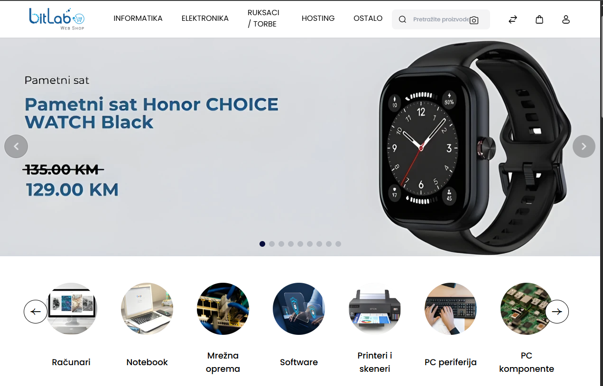
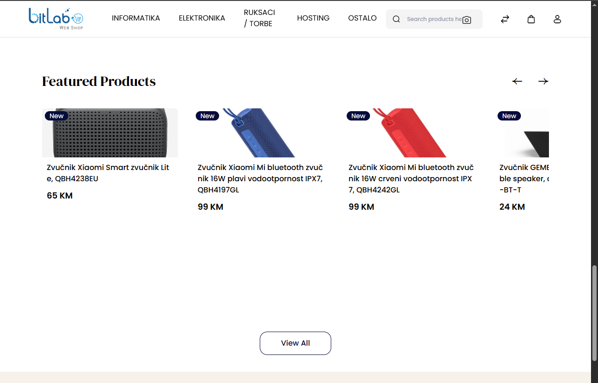
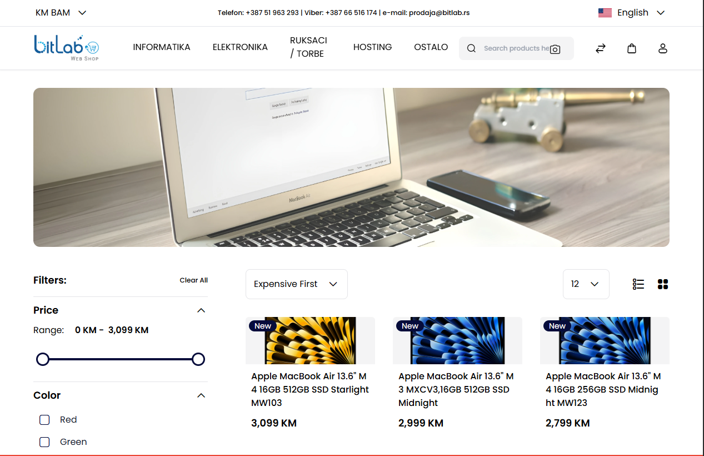
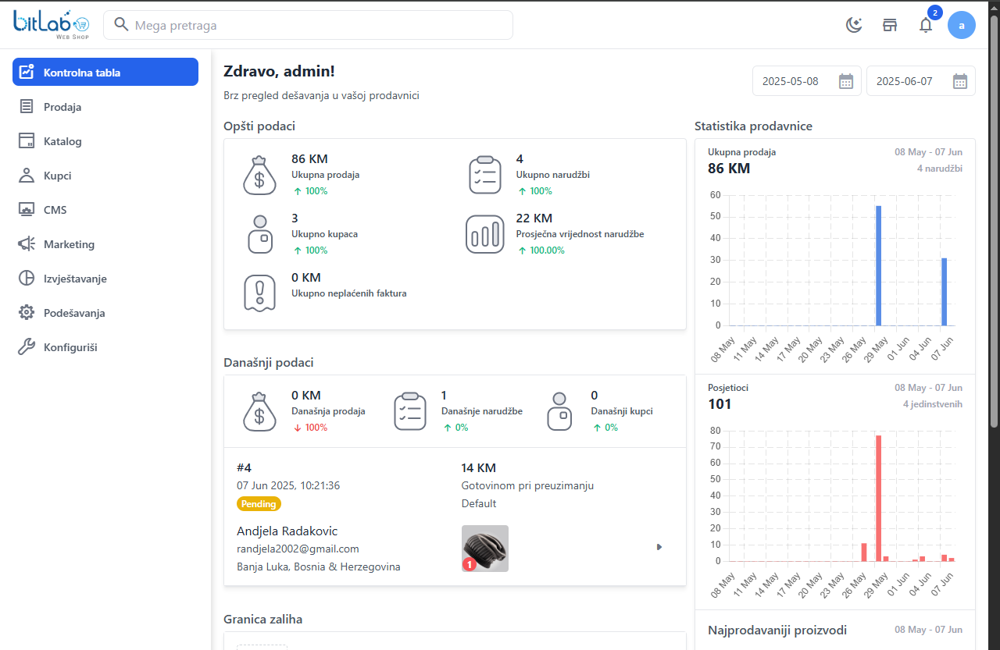
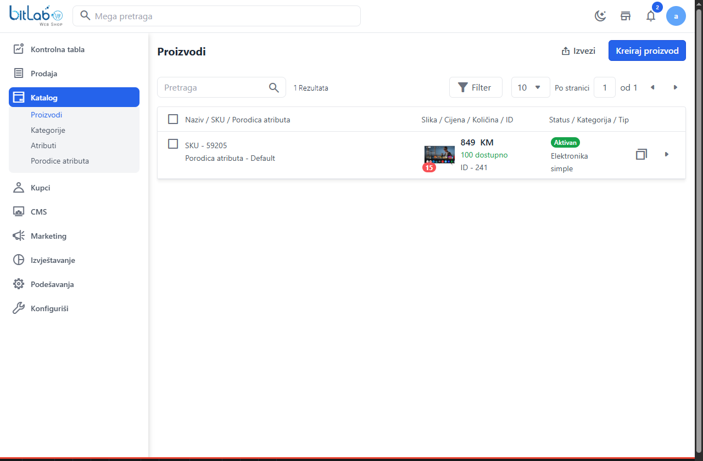
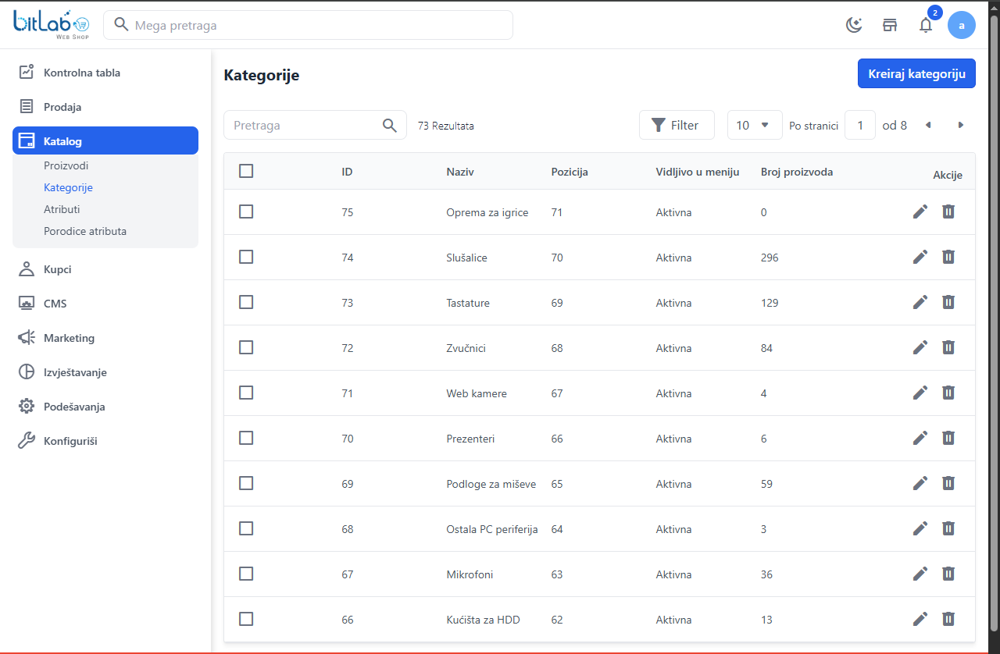
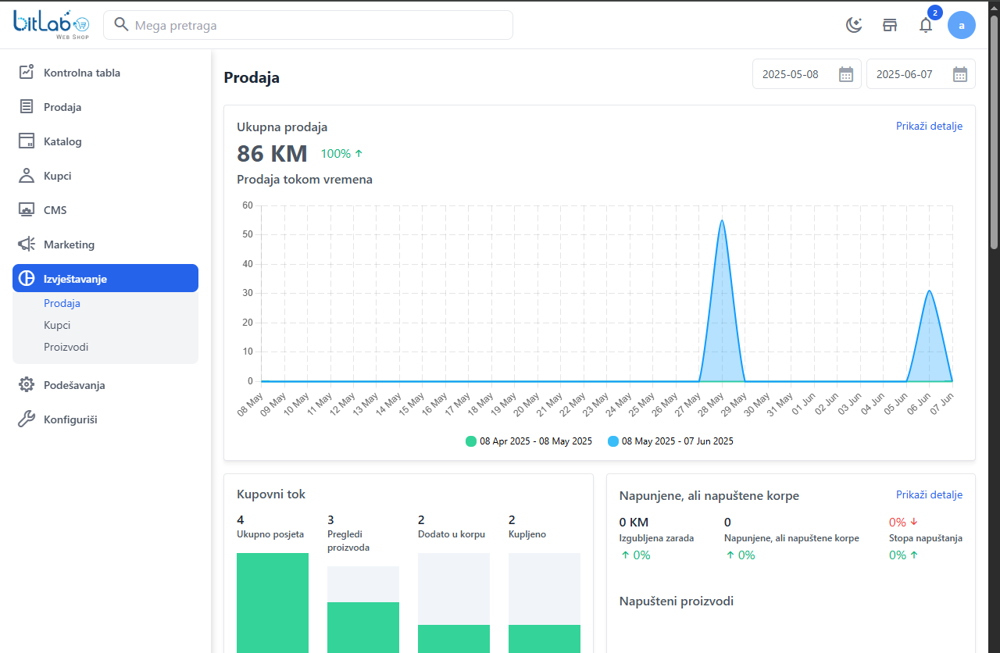
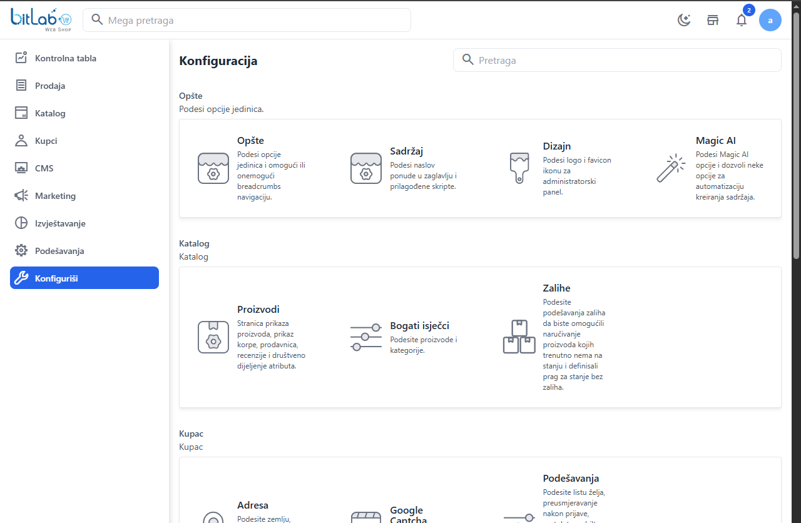

# 💻 IT equipment web shop

An IT product webshop developed using Laravel, Vue.js and the Bagisto eCommerce platform.

---

## 👥 User Side

- Product browsing and search
- Product details with images and specifications
- Shopping cart and checkout process
- User registration, login and order history
- Multilingual support (Serbian and English)
- Product reviews and ratings
- Wishlist and "save for later" functionality
- Filtering and sorting options
- Search autocomplete

---

## 🛠️ Admin Panel

- Product and category management  
- Order tracking and status updates  
- User and role management  
- Email notification setup  
- Configuration of payment, shipping and localization
- Dashboard with sales and user analytics
- Inventory management
- Discount and promotion management
- Admin and user activity logging

